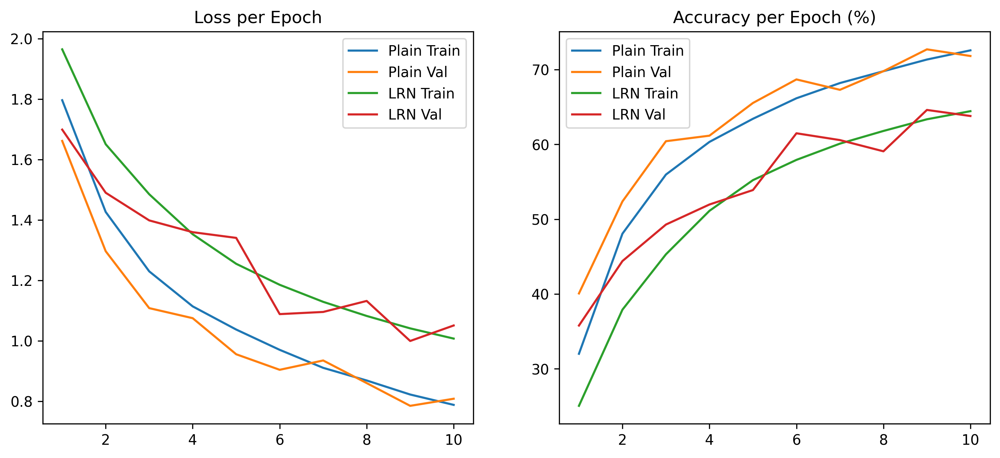

### Training Results

### Analysis
- LRN technique had a huge impact back then when alexnet is implemented. But, our present day batch normalization is way better than LRN because it converges way faster and has better regularization and stability.

- Paper Link: https://proceedings.neurips.cc/paper_files/paper/2012/file/c399862d3b9d6b76c8436e924a68c45b-Paper.pdf
